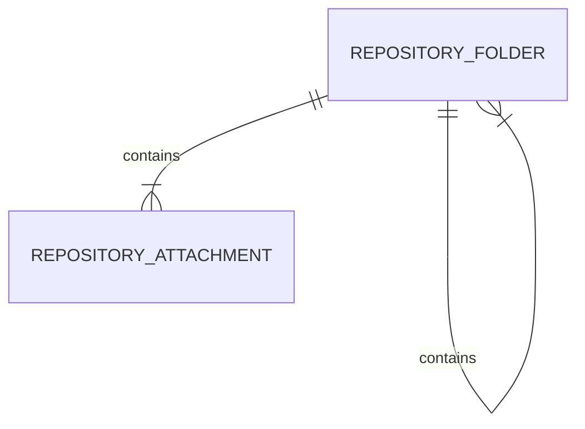
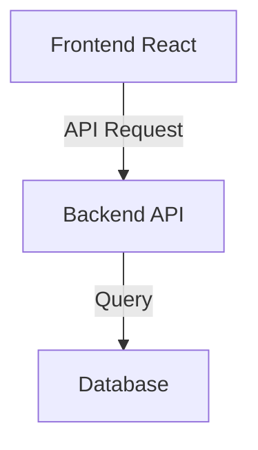

# ZASADY: Struktura dokumentacji projektów

Ten dokument definiuje **strukturę dokumentacji projektów** w repozytorium (format **Project Canvas**).

**Zasady stylu pisania:** Zobacz `STYL.md`

---

## Struktura plików projektu

Każdy projekt zawiera dwa pliki:

### 1. `README.md` - Mapa nawigacyjna (krótka)

**Cel:** Szybki przegląd projektu bez otwierania pełnej dokumentacji.

**Zawartość:**
- Status i podstawowe info (klient, PDM, Tech Lead)
- Link do pełnej dokumentacji używając linkowania Obsidian: `[[Nazwa-projektu]]` (nazwa bez ścieżki)
- Szybki przegląd (Problem / Rozwiązanie / Obecna faza)
- Kluczowe decyzje architektoniczne (tabela)
- Zakres obecnego MVP (jeśli aplikowalne)
- Główne ryzyka (jeśli aplikowalne)
- Szybkie linki (repo, środowiska, dokumenty)

**Długość:** ~50-100 linii (1-2 ekrany)

---

### 2. `Nazwa-projektu.md` - Project Canvas (pełna dokumentacja)

**Cel:** Szczegółowa, kompleksowa dokumentacja projektu w formacie **Project Canvas**.

**Format nazwy pliku:** Zgodny z nazwą katalogu projektu
- Przykład: `projekty/klienci/WIM/Podpis-kwalifikowany-macOS/Podpis-kwalifikowany-macOS.md`

---

## Format: Project Canvas

### Nagłówek

```markdown
# Project Canvas: [Nazwa Projektu]

**Status:** 🟢/🟡/🔴 [W analizie / W realizacji / Wdrożony / Wstrzymany]
**Powód statusu / Bloker:** [Jeśli status 🟡 lub 🔴, wyjaśnij dlaczego. Np. "Oczekiwanie na decyzję klienta ws. architektury" lub "Brak dostępu do środowiska testowego PWPW"]
**Ostatnia aktualizacja:** YYYY-MM-DD
**Klient:** [Nazwa klienta lub "AMODIT (roadmapa)"]
**Data rozpoczęcia:** YYYY-MM-DD
**Budżet/Czas:** [np. 20 MD / do uzupełnienia]

| Rola | Osoba | Odpowiedzialność |
|------|-------|------------------|
| **PDM** | [Imię] / [do uzupełnienia] | Zarządzanie projektem, kontakt z klientem |
| **Tech Lead** | [Imię] / [do uzupełnienia] | Architektura, Code Review |
| **Deweloper** | [Imię] / [do uzupełnienia] | Implementacja |
| **Tester** | [Imię] / [do uzupełnienia] | |
| **Opiekun handlowy** | [Imię] / [do uzupełnienia] | |
| **Klient (Decydent)** | [Imię Nazwisko] / [do uzupełnienia] | Akceptacja MVP, ostateczne decyzje biznesowe |
```

**Ikony statusu:**
- 🟢 W realizacji (aktywne prace)
- 🟡 W analizie / Planowane
- 🔴 Wstrzymany / Zablokowany
- ✅ Wdrożony / Ukończony

---

### Sekcja 1: PO CO TO ROBIMY? (Business Drivers)

**Cel:** Jasno skomunikować wartość biznesową projektu.

```markdown
## 1. PO CO TO ROBIMY? (Business Drivers)

### Problem
[Opis problemu biznesowego - 2-4 zdania]

### Cel biznesowy
[Co chcemy osiągnąć z perspektywy biznesu - konkretnie]

### Cel techniczny
[Co chcemy osiągnąć z perspektywy technicznej]

### Metryka sukcesu
[Jak zmierzymy sukces - konkretne KPI]
Przykład: "Użytkownik może znaleźć dokument w < 5 sekund"
```

**Zasady:**
- **Problem** musi być zrozumiały dla osoby spoza projektu
- **Cele** muszą być konkretne (unikaj "poprawa", "optymalizacja")
- **Metryka** musi być mierzalna

---

### Sekcja 2: USTALENIA ARCHITEKTONICZNE (Hard Constraints)

**Cel:** Zdefiniować ramy w których zespół ma swobodę.

```markdown
## 2. USTALENIA ARCHITEKTONICZNE (Hard Constraints)

### Zasada 1: [Tytuł zasady]
[Opis zasady - co MUSI być spełnione]

**Uzasadnienie:** [Dlaczego ta zasada obowiązuje]

### Zasada 2: [Tytuł zasady]
[...]

---

## Decyzje architektoniczne (ADR)

| ID | Status | Data | Decyzja | Uzasadnienie | Powód odrzucenia |
|----|--------|------|---------|--------------|------------------|
| ADR-001 | ✅ Zatwierdzone | YYYY-MM-DD | [Co zdecydowano] | [Dlaczego] | - |
| ADR-002 | 🔍 Do weryfikacji | YYYY-MM-DD | [Co zdecydowano] | [Dlaczego] | - |
| ADR-003 | ❌ Odrzucone | YYYY-MM-DD | [Co proponowano] | [Początkowe uzasadnienie] | [Dlaczego odrzucono] |
```

**Zasady:**
- Hard Constraints = ramy które **nie mogą być przekroczone** bez renegocjacji
- Każda zasada ma uzasadnienie (nie "bo tak")
- ADR (Architecture Decision Record) = tabela kluczowych decyzji technicznych
- ADR zawsze z datą, statusem i uzasadnieniem
- **Kolumna "Powód odrzucenia"** wypełniana dla statusów ❌ Odrzucone i 🔄 Wycofane

**Statusy ADR:**
- ✅ **Zatwierdzone** - decyzja ostateczna, implementowana
- 💡 **Propozycja** - do dyskusji, nie zatwierdzona
- 🔍 **Do weryfikacji** - wymaga dodatkowych testów/analiz
- ❌ **Odrzucone** - propozycja odrzucona (wypełnij kolumnę "Powód odrzucenia")
- 🔄 **Wycofane** - decyzja była wdrożona, ale została cofnięta (wypełnij kolumnę "Powód odrzucenia")

---

### Sekcja 3: FAZA PROJEKTU I RYZYKA

**Cel:** Transparentność co do stanu projektu i potencjalnych zagrożeń.

```markdown
## 3. FAZA PROJEKTU I RYZYKA

### Obecna faza: 🛠 [Nazwa fazy]

**Ukończono:**
- ✅ [Co zostało zrobione]
- ✅ [Co zostało zrobione]

**Trwa praca nad:**
- [Co obecnie robimy]
- [Co obecnie robimy]

---

### Główne ryzyka

| Ryzyko | Prawdopodobieństwo | Wpływ | Mitygacja | Właściciel |
|--------|-------------------|-------|-----------|------------|
| **[Wysokie/Średnie/Niskie]** Opis ryzyka | Niskie/Średnie/Wysokie | Niski/Średni/Wysoki | Co robimy aby zminimalizować | [Tech Lead / PDM / Imię] |
```

**Opcjonalnie - dla projektów w fazie analizy:**

```markdown
### Punkty wymagające decyzji (w fazie analizy)

**Nazwa obszaru:**
- [ ] Pytanie 1 do rozstrzygnięcia
- [ ] Pytanie 2 do rozstrzygnięcia
```

**Zasady:**
- Ryzyka priorytetyzowane: [Wysokie], [Średnie], [Niskie]
- Każde ryzyko MA mitygację (nie zostawiamy "do ustalenia")
- Każde ryzyko MA właściciela (osoba/rola odpowiedzialna za monitorowanie i mitygację)
- Właściciel może być rolą (Tech Lead, PDM) lub imieniem konkretnej osoby
- Punkty do decyzji tylko w fazie analizy - po decyzji przenosimy do ADR

---

### Sekcja 4: PACZKI DOSTARCZENIA (Roadmapa MVP)

**Cel:** Jasna roadmapa co i kiedy dostarczamy.

```markdown
## 4. PACZKI DOSTARCZENIA (Roadmapa MVP)

### 📦 PoC: "[Nazwa]" (Status: Ukończony / W trakcie)

**Cel:** [Dlaczego robimy PoC - co chcemy zweryfikować]

**Zrealizowane:**
- [x] [Co zostało zrobione]

---

### 📦 MVP1: "[Nazwa]" (Plan: Q4 2025 / Status)

**Cel:** [Dlaczego akurat taki zakres - co chcemy dostarczyć użytkownikowi]

**Definicja ukończenia (DoD):**
- [Warunki które muszą być spełnione aby uznać MVP za ukończone]
- [Mierzalne kryteria]

**Funkcjonalności:**
- [ ] Funkcjonalność A
- [ ] Funkcjonalność B

**Poza zakresem MVP (Out of Scope):**
- [Co świadomie NIE robimy w tym MVP - aby uniknąć rozползания się zakresu]
- [Np. "Obsługa podpisów chmurowych innych niż mSzafir"]

**Planowana data:** [Q4 2025 / do uzupełnienia]

---

### 📦 MVP2: "[Nazwa]" (Plan: Q1 2026)

[...]

---

### 📦 Backlog (przyszłe wersje)

**Funkcjonalności odroczone:**
- Funkcjonalność X (Priorytet: Niski)
- Funkcjonalność Y
```

**Zasady:**
- Każde MVP ma **cel** (dlaczego akurat ten zakres)
- Każde MVP ma **DoD** (Definition of Done) - konkretne warunki ukończenia
- Checklisty używają `- [ ]` dla pending, `- [x]` dla zrealizowanych
- MVP numerowane: MVP1, MVP2, MVP3 (nie MVP 1.0, 2.0)
- Backlog = odroczone funkcjonalności (nie usuwamy, mogą wrócić)

---

### Sekcja 5: HISTORIA ZMIAN

```markdown
## 5. HISTORIA ZMIAN

| Data | Zmiana | Źródło |
|------|--------|--------|
| [[YYYY-MM-DD]] | Krótki opis zmiany | [[YYYY-MM-DD Rada architektów]] |
| [[YYYY-MM-DD]] | Krótki opis zmiany | [[YYYY-MM-DD Sprint review]] |
```

**Zasady:**
- Chronologicznie (najstarsze na górze, najnowsze na dole)
- Zawsze z datą (link do dziennika `[[YYYY-MM-DD]]`) i źródłem (link Obsidian do notatki `[[YYYY-MM-DD Typ notatki]]`)
- Zwięzły opis (1 linia), szczegóły są w odpowiednich sekcjach powyżej
- **Linkowanie Obsidian:** Data jako dziennik `[[2025-08-12]]`, źródło jako notatka `[[2025-08-12 Rada architektów]]`

---

### Sekcja 6: PRZYDATNE LINKI (opcjonalna)

```markdown
## 6. PRZYDATNE LINKI

- **Repozytorium:** [link]
- **Środowisko DEV:** [link]
- **Środowisko TEST:** [link]
- **Dokumentacja zewnętrzna:** [link]
- **Umowa z klientem:** [link/numer]
- **Inicjatywa w backlogu:** [link do Azure DevOps]
```

---

### Sekcja 7: PODPROJEKTY (opcjonalna - dla dużych projektów)

**Cel:** Nawigacja do podprojektów dla dużych, złożonych projektów.

```markdown
## 7. PODPROJEKTY

| Podprojekt | Status | MVP | Opis |
|------------|--------|-----|------|
| [Edytor-formularzy](./Edytor-formularzy/) | 🟢 W realizacji | MVP1 Q4 2025 | Graficzny edytor układu formularza |
| [Edytor-diagramu](./Edytor-diagramu/) | 🟡 W analizie | MVP1 Q1 2026 | Wizualizacja przepływu procesu |
| [Matryca-uprawnien](./Matryca-uprawnien/) | ✅ Wdrożony | - | Tabelaryczne zarządzanie uprawnieniami |
```

**Zasady:**
- Każdy podprojekt ma własny katalog i pełny Project Canvas (szablon: `SZABLON-PODPROJEKT.md`)
- Podprojekt musi mieć link zwrotny do projektu nadrzędnego
- Tabela w projekcie nadrzędnym zawiera aktualny status każdego podprojektu

---

### Sekcja dodatkowa: ARCHITEKTURA TECHNICZNA (opcjonalna)

Dla projektów wymagających szczegółów technicznych (np. struktury bazy danych, API contracts).

```markdown
## X. ARCHITEKTURA TECHNICZNA (szczegóły)

### Technologie
- Frontend: [React / Angular / ...]
- Backend: [C# / Node.js / ...]
- Baza danych: [MSSQL / MySQL / ...]

### Struktura bazy danych

**Tabele:**

| Tabela | Kolumny | Opis |
|--------|---------|------|
| `nazwa_tabeli` | `col1`, `col2`, `col3` | Opis tabeli |

**Diagram relacji (opcjonalnie - dla lepszej czytelności):**



### Architektura komponentów (opcjonalnie)



### API Endpoints

[Jeśli absolutnie konieczne - lista kluczowych endpointów]
```

**Zasady:**
- Ta sekcja tylko gdy jest bezwzględnie potrzebna do zrozumienia projektu przez PDM/PM
- **Diagramy Mermaid jako DODATEK** do tabel - nie zastępują tabel, tylko je uzupełniają wizualizacją
- Tabele zawierają szczegóły (kolumny, typy), diagramy pokazują relacje
- Mermaid wspiera: diagramy ER (bazy danych), flowcharty, diagramy sekwencji, diagramy klas
- Szczegóły techniczne implementacji powinny być w dokumentacji technicznej w repozytorium kodu

---

## Zasady aktualizacji

### 1. Aktualizacja z notatek

Gdy aktualizujesz projekt na podstawie notatki:

1. **Przeczytaj `STYL.md`** - zasady JAK pisać
2. **Przeczytaj poprzednią wersję** Project Canvas tego projektu
3. **WAŻNE: Migracja do nowszego formatu**
   - Jeśli poprzednia wersja używa starego formatu (brak "Powód statusu", brak kolumny "Powód odrzucenia" w ADR, brak "Właściciel" w ryzykach), **natychmiast zaktualizuj strukturę** zgodnie z aktualnym szablonem
   - Dodaj brakujące kolumny/pola (można zostawić [do uzupełnienia] jeśli informacji nie ma w notatce)
   - **NIE konwertuj istniejących tabel** - zostaw je bez zmian
   - **Opcjonalnie dodaj diagram Mermaid** jako uzupełnienie (poniżej tabeli), jeśli pomoże to w wizualizacji relacji
4. **Zidentyfikuj zmiany:**
   - Nowe decyzje → Sekcja 2 (ADR) - dodaj ze statusem (💡 Propozycja lub ✅ Zatwierdzone)
   - Odrzucone decyzje → Sekcja 2 (ADR) - status ❌ Odrzucone + wypełnij "Powód odrzucenia"
   - Nowe ryzyka → Sekcja 3 - dodaj z właścicielem
   - Postęp w MVP → Sekcja 4 (checklisty)
   - Nowe funkcjonalności → Sekcja 4
   - Funkcjonalności odrzucone → Sekcja 4 "Poza zakresem MVP (Out of Scope)"
5. **Zaktualizuj Historię zmian** (Sekcja 5) - użyj linkowania Obsidian: `[[2025-08-12]]` dla daty, `[[2025-08-12 Rada architektów]]` dla źródła
6. **Zaktualizuj "Ostatnia aktualizacja"** w nagłówku
7. **Zaktualizuj "Powód statusu"** jeśli status zmienił się na 🟡 lub 🔴
8. **Zaktualizuj README.md** - szybki przegląd musi być spójny z Project Canvas
9. **Używaj linkowania Obsidian** - wszystkie linki przez `[[nazwa]]`, nie przez ścieżki

### 2. Nowy projekt

1. Skopiuj szablon z `SZABLON.md`
2. Wypełnij wszystkie sekcje zgodnie z `STYL.md`
3. Utwórz `README.md` na podstawie szablonu README
4. Dodaj projekt do `projekty/README.md` (centralny indeks)

### 3. Nowy podprojekt

1. Skopiuj szablon z `SZABLON-PODPROJEKT.md`
2. Utwórz katalog podprojektu wewnątrz projektu nadrzędnego
3. Wypełnij wszystkie sekcje zgodnie z `STYL.md`
4. **Dodaj link zwrotny** do projektu nadrzędnego w nagłówku
5. **Zaktualizuj projekt nadrzędny** - dodaj wpis w sekcji "7. PODPROJEKTY"

### 4. Statusy

**Statusy projektu:**
- 🟡 **W analizie** - zbieranie wymagań, projektowanie
- 🟢 **W realizacji** - aktywne prace deweloperskie
- ✅ **Wdrożony** - ukończony i wdrożony na produkcję
- 🔴 **Wstrzymany** - prace wstrzymane (podaj powód w opisie)

**Statusy funkcjonalności/zadań:**
- `Do realizacji` - zaakceptowane, czeka na implementację
- `W realizacji` - prace trwają
- `Zaimplementowane` / `Wdrożone` - ukończone
- `Do testów` - czeka na testy
- `Odroczone` - odłożone na przyszłość (podaj powód)
- `Odrzucone` - propozycja odrzucona (podaj powód)

---

## Linkowanie Obsidian

**WAŻNE:** Wszystkie dokumenty używają linkowania Obsidian (`[[nazwa]]`) dla tworzenia grafu powiązań między notatkami, projektami i podprojektami.

### Format linkowania

- **Projekty:** `[[Nazwa-projektu]]` (nazwa bez ścieżki - Obsidian znajdzie plik automatycznie)
- **Podprojekty:** `[[Nazwa-podprojektu]]` (nazwa podprojektu)
- **Notatki:** `[[2025-08-12 Rada architektów]]` (nazwa pliku bez ścieżki)
- **Dzienniki dat:** `[[2025-08-12]]` (format YYYY-MM-DD)

### Dzienniki dat

Gdy w projekcie występuje data decyzji, zmiany lub wydarzenia, używaj linkowania dziennika:
- `Decyzja podjęta [[2025-08-12]]`
- W tabeli Historia zmian: `| [[2025-08-12]] | Zmiana | [[2025-08-12 Rada architektów]] |`
- W ADR: `| ADR-001 | ✅ Zatwierdzone | [[2025-08-12]] | Decyzja | Uzasadnienie | - |`

**Obsidian automatycznie:**
- Utworzy plik `Dziennik/2025-08-12.md` (jeśli nie istnieje)
- Wyświetli linki zwrotne do wszystkich miejsc gdzie użyto tej daty
- Umożliwi przegląd wszystkich wydarzeń z danego dnia

**UWAGA:** Nie musisz tworzyć plików dzienników ręcznie - Obsidian zrobi to automatycznie przy pierwszym użyciu linku. Folder `Dziennik/` może być pusty - Obsidian utworzy pliki na żądanie.

## Kategorie projektów

Pełna lista kategorii i projektów: `projekty/README.md`

**Kategorie:**
- `moduly/` - główne moduły systemu AMODIT
- `cross-cutting/` - funkcjonalności przekrojowe
- `integracje/` - integracje z systemami zewnętrznymi
- `klienci/` - prace dedykowane dla klientów
- `koncepcje/` - pomysły i proof-of-concept
- `dokumentacja/` - standardy i procedury

---

## Kiedy tworzyć nowy projekt

Utwórz nowy projekt gdy:
- Temat **nie pasuje** do żadnego istniejącego projektu
- Temat jest **wystarczająco duży/ważny** by był osobnym bytem
- Temat ma **wyraźnie zdefiniowany zakres i cel**
- Temat będzie **osobno śledzony** (osobne MVP, osobny harmonogram)

**Nie twórz** nowego projektu gdy:
- Temat jest częścią istniejącego projektu (dodaj jako funkcjonalność w Sekcji 4)
- Temat został odrzucony/odłożony (dodaj do Backlog w istniejącym projekcie lub do `koncepcje/`)
- Temat to jednorazowy hotfix (dodaj do projektu którego dotyczy)

---

## Kiedy tworzyć podprojekt

Utwórz podprojekt gdy element głównego projektu:
- Ma **własny cykl życia** (osobne MVP, osobny harmonogram)
- Jest **na tyle duży**, że wymaga osobnego śledzenia (>50 linii dokumentacji)
- Ma **własny zespół** lub dedykowaną osobę
- Może być **niezależnie wdrożony** (nie blokuje innych części)

**Przykłady:**
- Edytor-procesow → Edytor-formularzy, Edytor-diagramu, Matryca-uprawnien
- Trust-Center → Podpisy-kwalifikowane-macOS, Podpisy-chmurowe

**Struktura katalogów:**

```
Projekt-glowny/
├── Projekt-glowny.md          # Główny Project Canvas + odsyłacze
├── README.md
├── Podprojekt-A/
│   ├── Podprojekt-A.md        # Pełny Project Canvas
│   └── README.md
└── Podprojekt-B/
    ├── Podprojekt-B.md
    └── README.md
```

---

## Typowe przypadki

### Hotfix / Krytyczny bug

- Status projektu: `🔴 Hotfix (najwyższy priorytet)`
- Wyraźnie oznacz w sekcji "PO CO TO ROBIMY" że jest krytyczny
- Dodaj do Sekcji 3 (Ryzyka) - co się stanie jeśli nie naprawimy

### Płatna modyfikacja dla klienta

- Umieść w `klienci/[Nazwa]/`
- Klient w nagłówku: `**Klient:** [Nazwa]`
- W sekcji "PO CO TO ROBIMY" zaznacz że to zamówienie klienta

### Wiele tematów w jednej notatce do jednego projektu

- Dodaj każdy jako osobną **funkcjonalność** w Sekcji 4 (MVP)
- Lub jako osobną **decyzję** w Sekcji 2 (ADR)
- **Historia zmian** (Sekcja 5) - jeden zbiorczy wpis z listą tematów

### Temat odłożony/odrzucony

- **Nie twórz** osobnego projektu
- Dodaj do **Backlog** w istniejącym projekcie (Sekcja 4)
- Lub umieść w `koncepcje/` jeśli może wrócić w przyszłości jako osobny projekt
- Zaznacz status `Odroczone` lub `Odrzucone` z **powodem**
